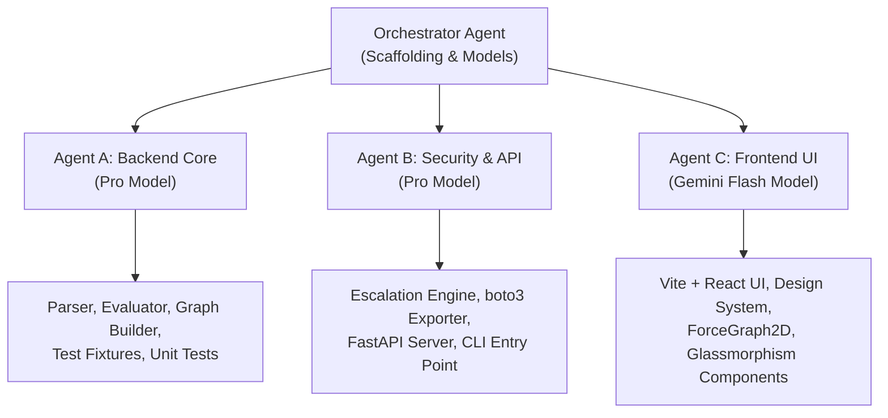
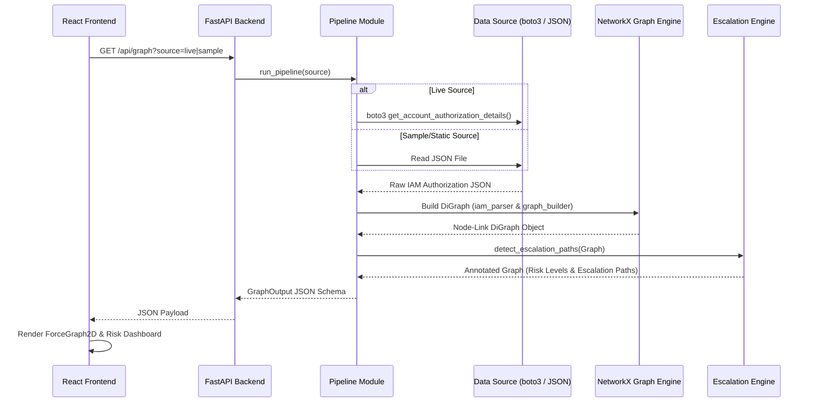

# Handoff & Architecture Documentation
## Cloud IAM Access & Privilege-Escalation Visualizer

---

## 1. Project Overview

The **Cloud IAM Access & Privilege-Escalation Visualizer** is a BloodHound-inspired security analysis tool built for AWS IAM environments. It ingests static or live IAM configurations, evaluates policy mechanics (including wildcard permissions and explicit deny precedence), constructs a directed permission graph using NetworkX, detects 21 known AWS IAM privilege-escalation vectors, and presents interactive visual graphs in a dark-mode React UI powered by `react-force-graph-2d`.

---

## 2. Multi-Agent Development Execution

The project was constructed concurrently using specialized subagents operating under an explicit architectural contract (`src/models.py`).



### Workstream Breakdown

1. **Orchestrator Setup**:
   - Initialized repository structure (`backend/`, `frontend/`).
   - Created security configurations (`.gitignore`, `.env.example`).
   - Standardized data schemas in `backend/src/models.py` (Pydantic).

2. **Agent A (Backend Core - Pro Model)**:
   - Built `iam_parser.py`, `policy_evaluator.py`, `graph_builder.py`.
   - Created 5 realistic IAM policy fixtures (`tests/fixtures/`).
   - Authored unit test suites (`test_iam_parser.py`, `test_policy_evaluator.py`, `test_graph_builder.py`).
   - Generated 3 baseline sample datasets (`backend/sample_data/`).

3. **Agent B (Security & API - Pro Model)**:
   - Implemented `escalation.py` with 21 Rhino Security Labs escalation rules.
   - Built `aws_exporter.py` with boto3 pagination, backoff jitter, and graceful exception handling.
   - Created `api.py` (FastAPI), `pipeline.py` (DRY engine), and `__main__.py` (CLI).
   - Authored `tests/test_escalation.py`.

4. **Agent C (Frontend - Gemini Flash Model)**:
   - Scaffolded Vite + React application.
   - Designed glassmorphism dark theme system (`frontend/src/index.css`).
   - Implemented `GraphView.jsx`, `NodeDetail.jsx`, `RiskDashboard.jsx`, `EscalationPath.jsx`, `PolicyViewer.jsx`, `DataSourceToggle.jsx`, `Header.jsx`.
   - Built `useGraphData.js` data fetching hook with offline fallback mode.
   - Verified production build output (`npm run build`).

---

## 3. Architecture & Data Flow



---

## 4. Backend Implementation

Located in [backend/](file:///c:/Users/jawad/Documents/Antigravity/cloud-iam-visualizer/backend):

- **[models.py](file:///c:/Users/jawad/Documents/Antigravity/cloud-iam-visualizer/backend/src/models.py)**: Shared Pydantic data schemas for IAM entities (`IAMUser`, `IAMRole`, `IAMGroup`, `IAMPolicy`), effective permissions, and output graph structures (`GraphNode`, `GraphLink`, `EscalationPath`, `GraphOutput`).
- **[iam_parser.py](file:///c:/Users/jawad/Documents/Antigravity/cloud-iam-visualizer/backend/src/iam_parser.py)**: Parses `aws iam get-account-authorization-details` dumps. Decodes URL-encoded policy documents, normalizes inline vs managed policies, and extracts group memberships and trust policies.
- **[policy_evaluator.py](file:///c:/Users/jawad/Documents/Antigravity/cloud-iam-visualizer/backend/src/policy_evaluator.py)**: Computes effective permissions. Supports `fnmatch` wildcard matching (e.g., `iam:*` -> `iam:CreatePolicyVersion`), enforces AWS Deny-overrides-Allow logic, and matches resource patterns.
- **[graph_builder.py](file:///c:/Users/jawad/Documents/Antigravity/cloud-iam-visualizer/backend/src/graph_builder.py)**: Models identity nodes (`user`, `role`, `group`, `policy`) and relationship edges (`can_assume`, `has_policy`, `member_of`, `can_access`). Uses `networkx.simple_cycles()` to identify circular role assumptions without infinite execution loops.
- **[escalation.py](file:///c:/Users/jawad/Documents/Antigravity/cloud-iam-visualizer/backend/src/escalation.py)**: Evaluates 21 privilege-escalation permission rules. Traces paths through identity graph via BFS, assigns risk levels (`critical`, `high`, `medium`, `low`), and marks high-risk nodes and edges.
- **[aws_exporter.py](file:///c:/Users/jawad/Documents/Antigravity/cloud-iam-visualizer/backend/src/aws_exporter.py)**: Performs live, read-only AWS IAM collection using `boto3`. Handles API pagination, implements exponential backoff with jitter for rate limits, and catches `AccessDeniedException` gracefully.
- **[api.py](file:///c:/Users/jawad/Documents/Antigravity/cloud-iam-visualizer/backend/src/api.py)**: FastAPI web application providing `/api/graph`, `/api/samples`, and `/api/health` with CORS support for frontend development.
- **[pipeline.py](file:///c:/Users/jawad/Documents/Antigravity/cloud-iam-visualizer/backend/src/pipeline.py)**: Unified workflow executor bridging ingestion, parsing, graph construction, escalation detection, and JSON serialization.
- **[__main__.py](file:///c:/Users/jawad/Documents/Antigravity/cloud-iam-visualizer/backend/src/__main__.py)**: Command-line interface to execute graph analysis directly to stdout or JSON file outputs.

---

## 5. Escalation Rules Catalog

The escalation engine ([escalation.py](file:///c:/Users/jawad/Documents/Antigravity/cloud-iam-visualizer/backend/src/escalation.py)) checks for the following 21 AWS IAM privilege escalation techniques:

| Rule ID | Technique Name | Required Permissions | Risk Level |
|---|---|---|---|
| `ESC-01` | CreateNewPolicyVersion | `iam:CreatePolicyVersion` | Critical |
| `ESC-02` | SetExistingDefaultPolicyVersion | `iam:SetDefaultPolicyVersion` | Critical |
| `ESC-03` | CreateEC2WithExistingIP | `iam:PassRole`, `ec2:RunInstances` | High |
| `ESC-04` | CreateUserAccessKey | `iam:CreateAccessKey` | High |
| `ESC-05` | CreateLoginProfile | `iam:CreateLoginProfile` | High |
| `ESC-06` | UpdateLoginProfile | `iam:UpdateLoginProfile` | High |
| `ESC-07` | AttachUserPolicy | `iam:AttachUserPolicy` | Critical |
| `ESC-08` | AttachGroupPolicy | `iam:AttachGroupPolicy` | Critical |
| `ESC-09` | AttachRolePolicy | `iam:AttachRolePolicy` | Critical |
| `ESC-10` | PutUserPolicy | `iam:PutUserPolicy` | Critical |
| `ESC-11` | PutGroupPolicy | `iam:PutGroupPolicy` | Critical |
| `ESC-12` | PutRolePolicy | `iam:PutRolePolicy` | Critical |
| `ESC-13` | AddUserToGroup | `iam:AddUserToGroup` | High |
| `ESC-14` | UpdateAssumeRolePolicy | `iam:UpdateAssumeRolePolicy` | High |
| `ESC-15` | PassRoleLambda | `iam:PassRole`, `lambda:CreateFunction`, `lambda:InvokeFunction` | Critical |
| `ESC-16` | PassRoleCloudFormation | `iam:PassRole`, `cloudformation:CreateStack` | Critical |
| `ESC-17` | PassRoleDataPipeline | `iam:PassRole`, `datapipeline:CreatePipeline`, `datapipeline:PutPipelineDefinition` | High |
| `ESC-18` | PassRoleGlue | `iam:PassRole`, `glue:CreateDevEndpoint` | High |
| `ESC-19` | UpdateExistingGlueDevEndpoint | `glue:UpdateDevEndpoint` | Medium |
| `ESC-20` | PassRoleSageMaker | `iam:PassRole`, `sagemaker:CreateNotebookInstance`, `sagemaker:CreatePresignedNotebookInstanceUrl` | High |
| `ESC-21` | PassRoleSSM | `iam:PassRole`, `ssm:StartSession` or `ssm:SendCommand` | High |

---

## 6. Frontend Implementation

Located in [frontend/](file:///c:/Users/jawad/Documents/Antigravity/cloud-iam-visualizer/frontend):

- **[index.css](file:///c:/Users/jawad/Documents/Antigravity/cloud-iam-visualizer/frontend/src/index.css)**: Modern dark theme styling using `hsl(220, 20%, 8%)` background, glassmorphism cards (`backdrop-filter: blur(16px)`), CSS variables, custom scrollbars, and Inter font family.
- **[GraphView.jsx](file:///c:/Users/jawad/Documents/Antigravity/cloud-iam-visualizer/frontend/src/components/GraphView.jsx)**: 2D force-directed canvas using `react-force-graph-2d`. Renders distinct geometric node shapes per type (Circle = User, Diamond = Role, Square = Group, Hexagon = Policy), highlights nodes by risk severity color, draws animated red particle streams on escalation edges, and provides zoom/pan/center controls.
- **[NodeDetail.jsx](file:///c:/Users/jawad/Documents/Antigravity/cloud-iam-visualizer/frontend/src/components/NodeDetail.jsx)**: Interactive right sidebar displaying selected node metadata, risk scores, effective permissions list, attached policy list, and active escalation paths.
- **[RiskDashboard.jsx](file:///c:/Users/jawad/Documents/Antigravity/cloud-iam-visualizer/frontend/src/components/RiskDashboard.jsx)**: Metric cards displaying Critical/High/Medium/Low/Total counts and a clickable list of the top riskiest identities in the environment.
- **[EscalationPath.jsx](file:///c:/Users/jawad/Documents/Antigravity/cloud-iam-visualizer/frontend/src/components/EscalationPath.jsx)**: Step-by-step chain renderer showing node traversal path, required IAM actions, and attack technique descriptions.
- **[PolicyViewer.jsx](file:///c:/Users/jawad/Documents/Antigravity/cloud-iam-visualizer/frontend/src/components/PolicyViewer.jsx)**: Syntax-highlighted JSON viewer with copy functionality for inspecting underlying policy documents.
- **[DataSourceToggle.jsx](file:///c:/Users/jawad/Documents/Antigravity/cloud-iam-visualizer/frontend/src/components/DataSourceToggle.jsx)**: Control bar enabling seamless switching between sample datasets (`small_org`, `overpermissioned`, `full_escalation`) and the live backend API.
- **[useGraphData.js](file:///c:/Users/jawad/Documents/Antigravity/cloud-iam-visualizer/frontend/src/hooks/useGraphData.js)**: Custom hook fetching graph data from the backend or loading bundled JSON fallbacks when running static demos.

---

## 7. Verification & Testing Results

### Backend Test Suite
All 14 unit tests passed successfully using `pytest`:

```bash
cd backend
python -m pytest tests/ -v
```

- `test_iam_parser.py`: Verified parsing of valid JSON, malformed JSON handling, URL-encoded policy decoding, and missing fields.
- `test_policy_evaluator.py`: Verified wildcard pattern expansion (`iam:*`), Deny-overrides-Allow logic, and resource pattern matching.
- `test_graph_builder.py`: Verified node/edge generation, NetworkX serialization, and cyclic role handling.
- `test_escalation.py`: Verified detection across policy modification, `iam:PassRole` vectors, group membership modification, and safe identity scoring.

### Frontend Production Build
Production build verified with Vite:

```bash
cd frontend
npm run build
```

- Output: `dist/` bundle compiled in ~2.37s with 0 errors.

---

## 8. Quick Start Guide

### Running the Backend API Server

```bash
# 1. Navigate to backend directory
cd backend

# 2. Install dependencies
pip install -r requirements.txt

# 3. Start API server
python -m uvicorn src.api:app --reload --port 8000
```

### Running the Frontend UI

```bash
# 1. Navigate to frontend directory
cd frontend

# 2. Install node dependencies
npm install

# 3. Start Vite development server
npm run dev
```

Open your browser to `http://localhost:5173`. Toggle between sample datasets or select "Live AWS Account" (if AWS environment variables are configured).

### CLI Usage (Standalone Backend)

```bash
# Process static JSON export to file
python -m src backend/tests/fixtures/escalation_scenarios.json --output output.json

# Process bundled sample dataset
python -m src --sample full_escalation --output sample_graph.json
```
