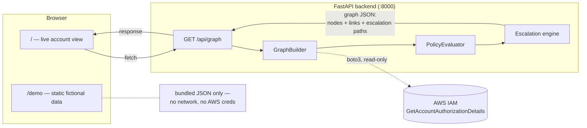

<div align="center">

# 🛡️ AWS IAM Privilege-Escalation Visualizer

**See your AWS account the way an attacker would.**

A graph-based tool that maps every IAM user, role, group, and policy in an AWS account, then automatically detects the privilege-escalation paths hiding in the trust and permission relationships between them.


</div>

---

> **📸 Screenshot goes here.** Run the app (see [Quick start](#quick-start)), open the `/demo` page, and drop a screenshot or GIF of the graph view at the top of this README — it's the single highest-value thing missing from this doc right now.

## What it does

Point it at a live AWS account (read-only) or open the built-in demo environment, and it will:

1. **Pull every identity** — IAM users, roles, groups, and policies — via `iam:GetAccountAuthorizationDetails`.
2. **Build a graph** of who can do what: group membership, attached/inline policies, and `sts:AssumeRole` trust relationships.
3. **Resolve effective permissions** for every identity by evaluating Allow/Deny statements.
4. **Run 21 known privilege-escalation techniques** against that graph — not just "who has `AdministratorAccess`," but *"can `bob.martinez` reach admin by assuming a role two hops away that nobody remembered to lock down?"*
5. **Render it** as an interactive force-directed graph, color-coded by risk, with every escalation chain click-through explorable node by node.

## Features

- 🕸️ **Interactive graph view** — force-directed layout (`react-force-graph-2d`) with shape-per-type encoding (circle = user, diamond = role, square = group, hexagon = policy), automatic zoom-to-fit, and label-collision avoidance so a 40+ node account doesn't turn into alphabet soup.
- 🔺 **Privilege-escalation detection** — a rule engine covering 21 documented AWS IAM escalation techniques (policy version tampering, `PassRole` combos with EC2/Lambda/CloudFormation/Glue/SageMaker/SSM, credential and login-profile creation, and more).
- 🎯 **False-positive aware** — a role that only an AWS service principal (e.g. `lambda.amazonaws.com`) can assume is correctly excluded as an escalation *starting point*, since no external identity can ever reach it. Permissions scoped to `aws-service-role/*` are also excluded, since AWS blocks direct API modification of true service-linked roles regardless of what IAM allows.
- 📊 **Risk dashboard** — live counts by severity and a ranked list of the riskiest identities in the account.
- 🔍 **Search, drill-down, and escalation-chain walking** — click any node to see its effective permissions, attached policies, and every escalation path it's part of; click through a chain node-by-node.
- 🎭 **Demo mode** — a realistic, fully fictional 26-node environment (`/demo`) with 9 escalation paths, so the tool is explorable without AWS credentials at all.

## How the escalation detection works

The graph gives you *reachability* (who can become whom); the rule engine gives you *exploitability* (what they can do once they get there). A path only counts as an escalation if an identity can actually reach — via group membership or role assumption — a point in the graph where one of these technique patterns is satisfied:

<details>
<summary><b>All 21 techniques checked</b> (click to expand)</summary>

| Technique | Risk | Required permissions |
|---|---|---|
| CreateNewPolicyVersion | Critical | `iam:CreatePolicyVersion` |
| SetExistingDefaultPolicyVersion | Critical | `iam:SetDefaultPolicyVersion` |
| AttachUserPolicy | Critical | `iam:AttachUserPolicy` |
| AttachGroupPolicy | Critical | `iam:AttachGroupPolicy` |
| AttachRolePolicy | Critical | `iam:AttachRolePolicy` |
| PutUserPolicy | Critical | `iam:PutUserPolicy` |
| PutGroupPolicy | Critical | `iam:PutGroupPolicy` |
| PutRolePolicy | Critical | `iam:PutRolePolicy` |
| PassRoleLambda | Critical | `iam:PassRole` + `lambda:CreateFunction` + `lambda:InvokeFunction` |
| PassRoleCloudFormation | Critical | `iam:PassRole` + `cloudformation:CreateStack` |
| CreateEC2WithExistingIP | High | `iam:PassRole` + `ec2:RunInstances` |
| CreateUserAccessKey | High | `iam:CreateAccessKey` |
| CreateLoginProfile | High | `iam:CreateLoginProfile` |
| UpdateLoginProfile | High | `iam:UpdateLoginProfile` |
| AddUserToGroup | High | `iam:AddUserToGroup` |
| UpdateAssumeRolePolicy | High | `iam:UpdateAssumeRolePolicy` |
| PassRoleDataPipeline | High | `iam:PassRole` + `datapipeline:CreatePipeline` + `datapipeline:PutPipelineDefinition` |
| PassRoleGlue | High | `iam:PassRole` + `glue:CreateDevEndpoint` |
| PassRoleSageMaker | High | `iam:PassRole` + `sagemaker:CreateNotebookInstance` + `sagemaker:CreatePresignedNotebookInstanceUrl` |
| PassRoleSSM | High | `iam:PassRole` + `ssm:StartSession`/`SendCommand` |
| UpdateExistingGlueDevEndpoint | Medium | `glue:UpdateDevEndpoint` |

</details>

This technique catalog follows the well-established AWS IAM privilege-escalation research originally published by [Rhino Security Labs](https://rhinosecuritylabs.com/aws/aws-privilege-escalation-methods-mitigation/) — the contribution here is the graph-based reachability layer built around it, not the techniques themselves.

## Architecture



`/demo` never touches the backend or AWS — it renders `frontend/src/data/demoGraph.json` directly, so the whole tool is explorable with nothing installed but Node.

## Quick start

**Backend** (needs an AWS profile with the permissions below):

```bash
cd backend
pip install -r requirements.txt

# macOS/Linux
export AWS_PROFILE=your-profile-name
# Windows PowerShell
$env:AWS_PROFILE = "your-profile-name"

python -m uvicorn src.api:app --host 127.0.0.1 --port 8000
```

**Frontend** (separate terminal):

```bash
cd frontend
npm install
npm run dev
```

Open **http://localhost:5173** — `/` is the live account, `/demo` needs nothing above and works immediately.

> **Note:** run `uvicorn` from inside `backend/`, not the repo root — the `src` package resolves relative to the working directory.

### Minimal IAM policy

The backend makes exactly two AWS API calls, both read-only:

```json
{
  "Version": "2012-10-17",
  "Statement": [
    {
      "Effect": "Allow",
      "Action": ["iam:GetAccountAuthorizationDetails", "sts:GetCallerIdentity"],
      "Resource": "*"
    }
  ]
}
```

Nothing in this codebase ever calls a mutating IAM API.

### Running the tests

```bash
cd backend
pytest
```

## Tech stack

| | |
|---|---|
| **Backend** | Python 3.11+, FastAPI, Pydantic, boto3, NetworkX, pytest |
| **Frontend** | React 18, Vite 5, react-router-dom, react-force-graph-2d (Canvas 2D + d3-force) |

## Project structure

```
backend/
  src/
    aws_exporter.py       # live AWS export (boto3, paginated, backoff/retry)
    iam_parser.py          # raw IAM JSON -> typed models
    graph_builder.py        # entities -> graph nodes/links, reachability check
    policy_evaluator.py     # Allow/Deny statement resolution
    escalation.py           # the 21-technique rule engine
    pipeline.py              # orchestrates the above into one GraphOutput
    api.py                    # FastAPI app, single /api/graph endpoint
  tests/                       # pytest suite + fixtures

frontend/
  src/
    pages/            # AccountPage (live), DemoPage (static)
    components/       # GraphView, RiskDashboard, NodeDetail, EscalationPath...
    data/demoGraph.json  # the fictional demo dataset
    hooks/useGraphData.js # live-data fetch hook
```

## Roadmap / known gaps

Written down on purpose, not discovered by an unlucky user:

- **Resource-level nodes aren't populated yet.** The schema has a `resource` node type and a `can_access` relationship (e.g. for S3/KMS access), but the graph builder doesn't emit them yet.
- **No caching.** Every page load re-fetches and rebuilds the entire account graph from scratch — fine for exploring one account interactively, not built for repeated automated polling.
- **Single account, single session.** No multi-account aggregation or historical comparison between runs.
- **Planned extension:** pulling CloudTrail events to compute a *granted-vs-actually-used* permission diff, and emitting Terraform patches to right-size policies.

## License

No license file yet — all rights reserved by default until one is added.

